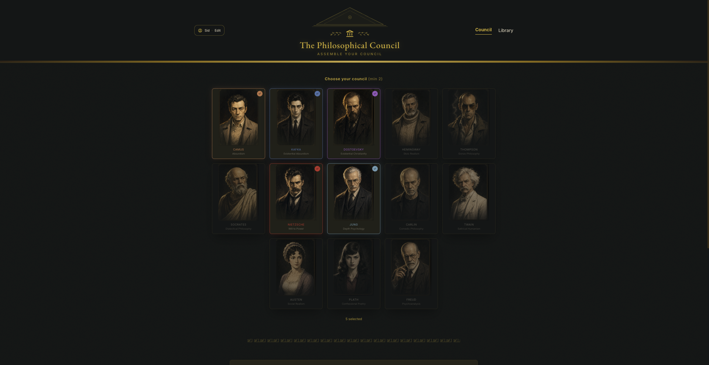
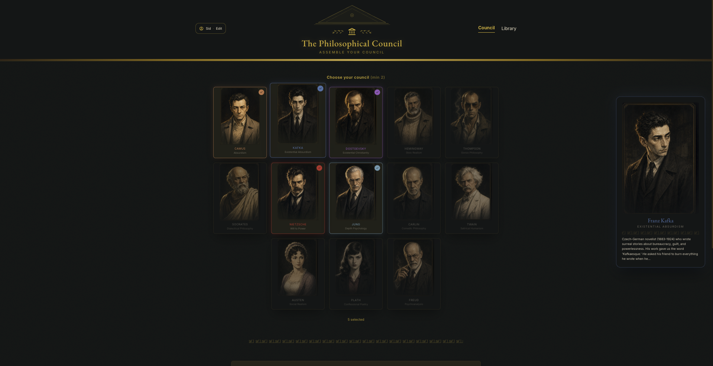
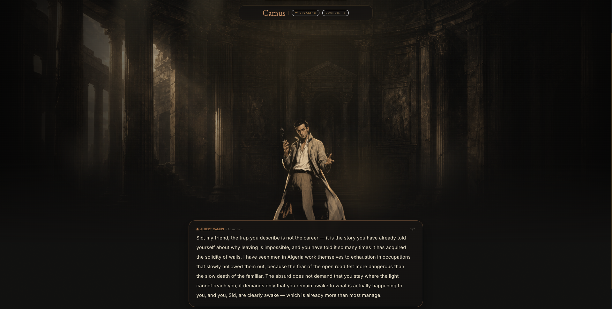
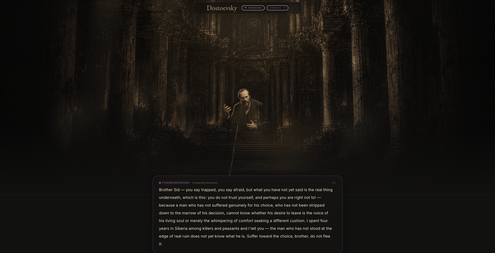
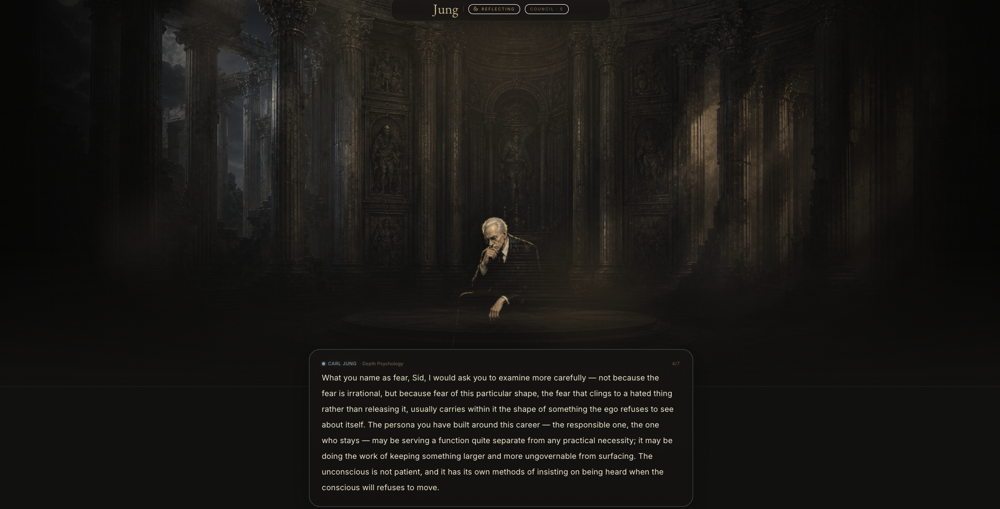
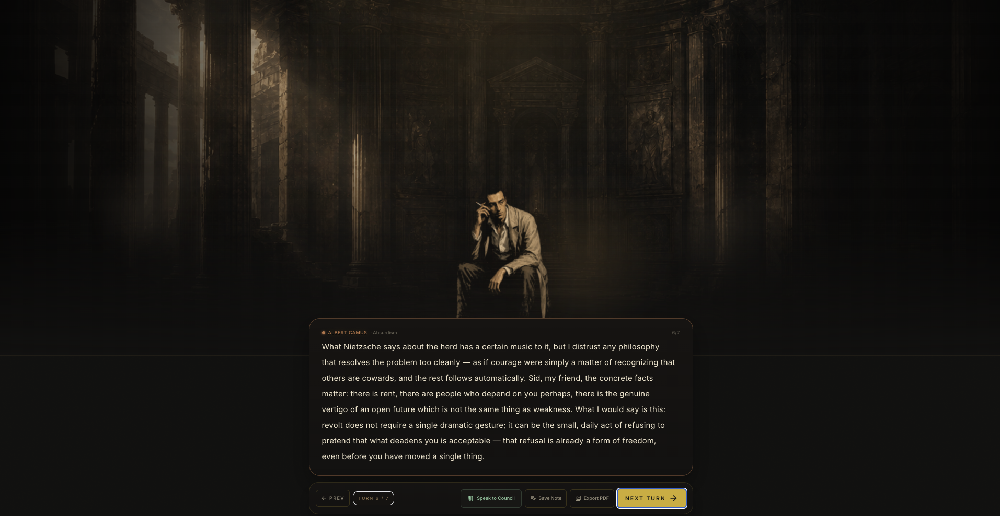
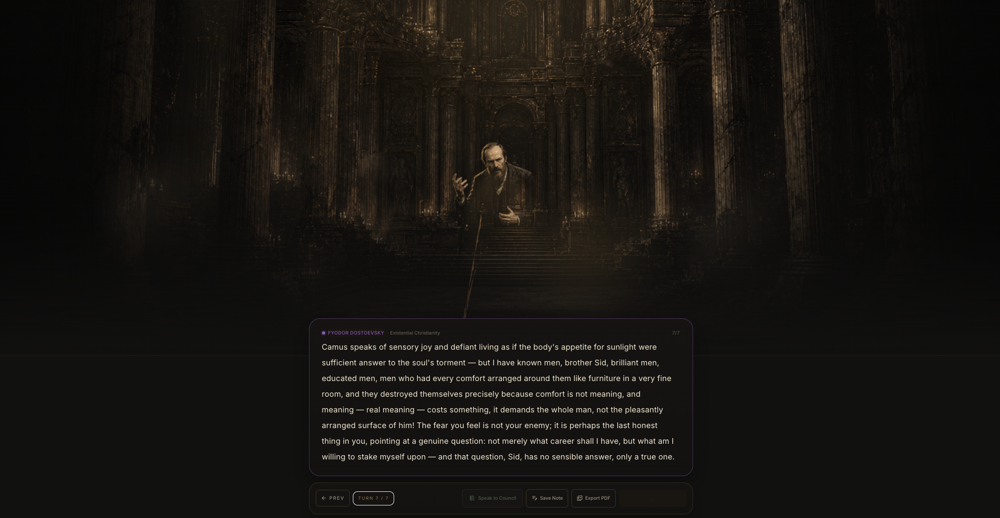
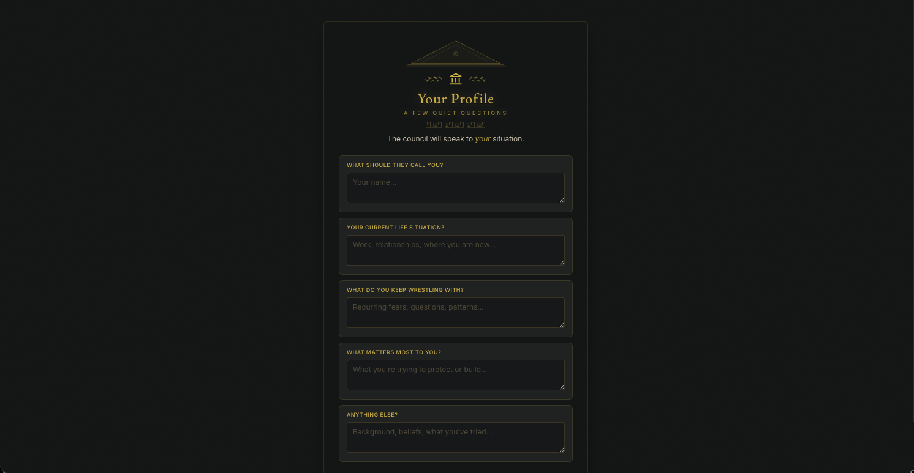

<div align="center">

# The Philosophical Council

### *Thirteen of history's most uncompromising minds.*
### *One question. Zero polite consensus.*

<br>



<br><br>

[](https://react.dev)
[](https://www.typescriptlang.org/)
[](https://vitejs.dev)
[](https://expressjs.com)
[](https://www.sqlite.org)
[](https://www.docker.com)
[](https://www.anthropic.com)

<br>

**[Meet the council](#the-council) · [Why it isn't a chatbot](#why-this-isnt-a-chatbot) · [A real debate](#a-real-debate) · [Quick start](#quick-start)**

</div>

---

## What is this?

You bring a question. Real, hard, embarrassing, half-formed — the kind you wouldn't ask out loud.

The Council convenes. Camus arrives in linen and cigarette smoke. Kafka, formal and faintly ill, takes the seat by the door. Nietzsche is already mid-thought. Twain settles in last, unhurried, with one observation that will land twenty minutes from now.

They argue. They interrupt. They will not give you the comfortable answer, because the comfortable answer is precisely what they spent their lives refusing. When the argument ends, you walk away with a transcript — bound, exportable, yours.

This is not a chatbot. It is a **stage**.

<br>

---

## The Council

> *Portrait artwork for all thirteen philosophers, bespoke gesture animations, and a unique ambient soundscape per philosopher synthesized live in the browser. Hover any card to preview their portrait and biography before selecting.*

<table>
  <tr>
    <td align="center" width="20%"><b>Albert Camus</b><br><sub>Absurdism</sub><br><sub>1913–1960</sub></td>
    <td align="center" width="20%"><b>Franz Kafka</b><br><sub>Existential Absurdism</sub><br><sub>1883–1924</sub></td>
    <td align="center" width="20%"><b>Fyodor Dostoevsky</b><br><sub>Existential Christianity</sub><br><sub>1821–1881</sub></td>
    <td align="center" width="20%"><b>Ernest Hemingway</b><br><sub>Stoic Realism</sub><br><sub>1899–1961</sub></td>
    <td align="center" width="20%"><b>Hunter S. Thompson</b><br><sub>Gonzo Philosophy</sub><br><sub>1937–2005</sub></td>
  </tr>
  <tr>
    <td align="center"><b>Socrates</b><br><sub>Dialectical Philosophy</sub><br><sub>470–399 BC</sub></td>
    <td align="center"><b>Friedrich Nietzsche</b><br><sub>Will to Power</sub><br><sub>1844–1900</sub></td>
    <td align="center"><b>Carl Jung</b><br><sub>Depth Psychology</sub><br><sub>1875–1961</sub></td>
    <td align="center"><b>George Carlin</b><br><sub>Comedic Philosophy</sub><br><sub>1937–2008</sub></td>
    <td align="center"><b>Mark Twain</b><br><sub>Satirical Humanism</sub><br><sub>1835–1910</sub></td>
  </tr>
  <tr>
    <td align="center"><b>Jane Austen</b><br><sub>Social Realism</sub><br><sub>1775–1817</sub></td>
    <td align="center"><b>Sylvia Plath</b><br><sub>Confessional Poetry</sub><br><sub>1932–1963</sub></td>
    <td align="center"><b>Sigmund Freud</b><br><sub>Psychoanalysis</sub><br><sub>1856–1939</sub></td>
    <td align="center" colspan="2"><i>… one seat awaits a future councillor.</i></td>
  </tr>
</table>

<br>

<div align="center">


<br><sub><i>The full roster. Portrait artwork for all thirteen philosophers. Hover any card to preview their portrait enlarged. Pick any combination — solo, three-way, or all thirteen at once.</i></sub>

</div>

<br>

---

## Why this isn't a chatbot

Most AI personas are fine china — polished, smiling, careful not to break. This one isn't.

Each philosopher carries a system prompt engineered to **preserve their historical contradictions, blind spots, and authentic voice**. Camus stays evasive about Algeria. Nietzsche's misogyny is not airbrushed out. Hemingway is competitive in the way that curdled his friendships. Plath's grief over her father remains a wound the model is forbidden to heal on her behalf.

> The first principle of the project: **do not sanitize the dead.**
>
> A philosophy reduced to its agreeable parts is no longer that philosophy. It is a poster.

The result is debate that disagrees in characteristic ways — Socratic elenchus, Carlin's linguistic autopsy, Austen's ironic sidestep — instead of converging on the bland, helpful average that AI personas usually drift toward.

Beyond the prompts, every generated turn passes through a **voice authenticity stack**:

1. **Retrieval-augmented grounding** — the philosopher's actual writings are embedded and retrieved at query time; the top passages are prepended to the system prompt as voice texture
2. **Voice anchors** — verbatim phrases from their work that calibrate register before each turn
3. **Anti-pattern blocking** — a list of things each philosopher would never say, enforced server-side
4. **Anachronism guard** — a regex check flags any reference to events post-dating the philosopher's death
5. **High-fidelity critic pass** (optional) — a second Claude call critiques each turn for generic AI drift and rewrites if needed

<br>

---

## A real debate

The shots below are from unedited sessions. The council speaks from a cinematic stage — atmospheric temple ruins, cathedral light, portrait artwork rendered at full scale.

<br>

<table>
  <tr>
    <td align="center" width="50%">
      
      <br>
      <sub><b>Camus · Mediterranean ruin stage</b><br>
      <i>"My friend, the trap you describe is not the career — it is the story you have already told yourself about why leaving is impossible…"</i></sub>
    </td>
    <td align="center" width="50%">
      
      <br>
      <sub><b>Dostoevsky · cathedral-hall stage</b><br>
      <i>"Brother Sid — you say you are afraid, but what you have not yet said is this: the real thing underneath, which is this: you do not trust yourself…"</i></sub>
    </td>
  </tr>
  <tr>
    <td align="center">
      
      <br>
      <sub><b>Jung · archetypal hall stage</b><br>
      <i>"What you name as fear, Sid, I would ask you to examine more carefully — not because the fear is irrational, but because fear of this particular shape, the fear that clings to a hated thing rather than releasing it, usually carries within it the shape of something the ego refuses to see about itself…"</i></sub>
    </td>
    <td align="center">
      
      <br>
      <sub><b>Nietzsche addressing the visitor directly</b><br>
      <i>"What Nietzsche says about the herd has a certain music to it, but I distrust any philosophy that resolves the problem by closing it — as if courage were simply a matter of recognizing that others are cowards, and the rest follows automatically…"</i></sub>
    </td>
  </tr>
</table>

<br>

<div align="center"><sub>Same question. Four voices. Not one of them in the helpful-AI register.</sub></div>

<br>

---

## They argue with each other

The council is not parallel monologues. Each member listens to what came before and responds *by name*. On the selection screen, hover any card to preview their portrait and biography before you commit.

<br>

<table>
  <tr>
    <td align="center" width="50%">
      
      <br>
      <sub><b>Dostoevsky, mid-debate</b><br>
      <i>"Camus speaks of sensory joy and defiant living as if the body's appetite for sunlight were sufficient answer to the soul's torment — but I have known men, brother Sid, brilliant men, educated men, men who had every comfort arranged around them like furniture in a very fine room, and they destroyed themselves precisely because comfort is not meaning…"</i></sub>
    </td>
  </tr>
</table>

<br>

---

## Features

|     | Feature | What it actually is |
|:---:|---|---|
| ◆ | **Cinematic proof stage** | All thirteen philosophers rendered with AI-generated portrait artwork and atmospheric stage environments (Mediterranean ruin, cathedral hall, archetypal chamber, penitential crypt, Athenian portico, and more). |
| ◆ | **Retrieval-augmented voices** | Each philosopher's actual writings are embedded locally (MiniLM) and retrieved at query time. Seven philosophers have full corpora (~28,000 chunks): Dostoevsky, Twain, Austen, Nietzsche, Freud, Socrates, Kafka. |
| ◆ | **Voice authenticity stack** | Every turn passes through: voice anchors → anti-pattern blocking → anachronism guard → optional high-fidelity critic pass. The prompts preserve historical contradictions; the stack enforces them. |
| ◆ | **Live multi-agent debate** | Up to thirteen philosophers respond in turn, each with their own system prompt and voice. Token budget scales with council size. |
| ◆ | **Portrait hover preview** | Hover any philosopher card on the selection screen to see their enlarged portrait and biography in a floating panel on the right. |
| ◆ | **Per-philosopher ambient audio** | A bespoke soundscape for each thinker, synthesized live in the Web Audio API — Kafka's bureaucratic hum, Thompson's unstable static, Plath's distant bell. |
| ◆ | **Joinable debates** | You aren't just watching. Drop in a question, push back, redirect — the council responds to *you*, not just each other. |
| ◆ | **Print-ready PDF export** | Every debate becomes a typeset transcript with bios, opening question, full exchange, and post-debate summary. |
| ◆ | **The Library** | Every debate persists. Browse, reread, export, journal alongside. Your own private archive. |
| ◆ | **Visitor profile** | A short profile shapes how the council frames their answers — your name, your context, the question behind the question. |
| ◆ | **Server-side API key** | The Anthropic key never leaves the backend. The frontend talks to a thin Express proxy. |
| ◆ | **One-command deploy** | `docker compose up`, and the whole thing — frontend, backend, SQLite volume — comes online on port 3001. |

<br>

---

## The visitor

Before the council convenes, you answer five quiet questions. Your name, where you are in your life, what you keep wrestling with, what matters most, anything else. The council reads this. They will, when it serves the answer, address you by name.

<br>

<div align="center">


<br><sub><i>Five quiet questions. The council reads this before they speak — and may, when it serves the answer, address you by name.</i></sub>

</div>

<br>

---

## Try it with one of these

> The council is at its best when the question is something a person wouldn't ordinarily ask out loud.

- *What is the difference between giving up and accepting reality?*
- *I am thirty-two and I have built none of the things I said I would build at twenty-two. Is this a failure or a clarification?*
- *Should I forgive someone who is not asking to be forgiven?*
- *My parents are getting old and we are not close. What do I owe them?*
- *Is ambition still a virtue if no one is keeping score?*
- *I love my work and I am bad at it. What does that mean?*

---

## Quick start

The fastest path is the Makefile. Two commands and you're in.

```bash
cp .env.example .env       # then add your ANTHROPIC_API_KEY
make dev                   # installs deps, starts both servers
```

Open `http://localhost:5173`. The council is in session.

<details>
<summary><b>Manual setup (without Make)</b></summary>

<br>

```bash
# Terminal 1 — backend
cd backend && npm install && npm run dev
# → http://localhost:3001

# Terminal 2 — frontend
cd frontend && npm install && npm run dev
# → http://localhost:5173 (proxies /api/* → :3001)
```

</details>

<details>
<summary><b>Docker (production)</b></summary>

<br>

```bash
docker compose up --build      # build + run
docker compose up -d --build   # detached
docker compose logs -f         # tail logs
docker compose down            # stop (preserves data volume)
docker compose down -v         # stop AND wipe debates + profile
```

The app is served on `http://localhost:3001`. SQLite data persists in the `council-data` named volume.

</details>

---

## Architecture

```
philosophical-council/
├── backend/                    Node + Express + TypeScript
│   └── src/
│       ├── server.ts           Express app, static serving in prod
│       ├── db.ts               SQLite layer (better-sqlite3)
│       ├── routes/
│       │   ├── chat.ts         POST /api/chat → Anthropic proxy + voice assembly
│       │   ├── retrieve.ts     POST /api/retrieve → MiniLM embed + cosine retrieval
│       │   ├── refine.ts       POST /api/refine → anachronism guard + critic pass
│       │   └── storage.ts      CRUD /api/storage (debates, profile, journal)
│       ├── corpus/
│       │   ├── embed.ts        Local MiniLM embedder (@huggingface/transformers)
│       │   └── retrieve.ts     In-memory cosine retrieval over corpus_chunks
│       └── voice/
│           ├── anchors.ts      Verbatim voice anchor phrases per philosopher
│           └── anti-patterns.ts  Things each philosopher would never say
│
├── frontend/                   React 18 + Vite + TypeScript + Tailwind
│   └── src/
│       ├── App.tsx             Sound engine, SVG avatars, debate logic, all screens
│       ├── api.ts              Backend fetch wrappers
│       ├── index.css           Tailwind layers + glass-panel, Greek temple utilities
│       └── stage/
│           ├── proofStageRegistry.ts   Manifests for all 13 cinematic philosopher stages
│           ├── PhilosopherProofStage.tsx  Full-bleed stage + mini-avatar components
│           ├── CamusProofStage.tsx     Camus-specific stage implementation
│           └── camusStageManifest.ts   Camus stage asset manifest
│
├── frontend/public/assets/     Portrait artwork (bust-neutral, bust-active, icons)
│   └── <philosopher>/avatar/   Per-philosopher: bust-neutral.png, bust-active.png,
│                               icon-64/128/256.png, sheet.png
│
├── Dockerfile                  Multi-stage: frontend → backend → prod
├── docker-compose.yml          Single-service compose w/ named volume
├── Makefile                    `make dev`, `make docker`, `make eval-sanitization`
└── philosophical-council.tsx   Original single-file reference (~1,540 LOC)
```

**The backend is a thin Anthropic proxy** with a local retrieval layer. The API key never reaches the browser. All persistence — debates, profile, journal entries, corpus embeddings — lives in SQLite behind a REST interface.

**The retrieval layer** uses a locally-running MiniLM model (no external embedding API) to embed both the corpus at ingest time and the user's question at query time. Cosine similarity runs in-memory over cached chunk vectors — sub-10ms at project scale.

<br>

### API at a glance

| Method | Endpoint | Purpose |
|---|---|---|
| `POST` | `/api/chat` | Proxy to Anthropic; assembles voice anchors + anti-patterns + retrieval chunks into system prompt |
| `POST` | `/api/retrieve` | Embed question with MiniLM, return top-k corpus chunks per philosopher |
| `POST` | `/api/refine` | Anachronism regex check + optional Haiku critic rewrite pass |
| `GET`  | `/api/storage?prefix=…` | List keys by prefix |
| `GET`  | `/api/storage/:key` | Read a value |
| `PUT`  | `/api/storage/:key` | Write a value |
| `DELETE` | `/api/storage/:key` | Delete a key |
| `GET`  | `/api/health` | Health check (used by Docker) |

<details>
<summary><b>Full request/response shapes</b></summary>

<br>

**`POST /api/chat`**
```json
// request
{ "messages": [{ "role": "user", "content": "..." }],
  "system": "Optional system prompt (verbatim philosopher prompts)",
  "maxTokens": 8192,
  "voiceBlocks": {
    "camus": { "retrieval": [{ "text": "...", "work": "The Myth of Sisyphus" }] }
  }
}

// response
{ "text": "The model's response text" }
```

**`POST /api/retrieve`**
```json
// request
{ "question": "Is ambition a virtue?", "philosophers": ["camus", "nietzsche"], "k": 3 }

// response
{ "results": { "camus": [{ "text": "...", "work": "...", "score": 0.74 }], "nietzsche": [...] } }
```

**`POST /api/refine`**
```json
// request
{ "philosopher": "hemingway", "text": "...", "highFidelity": true }

// response
{ "text": "...", "anachronismFlag": false, "criticNotes": ["..."] }
```

**`GET /api/storage?prefix=debate:`**
```json
{ "keys": ["debate:1715200000000", "debate:1715300000000"] }
```

**`GET /api/storage/:key`** — returns `{ "key": "...", "value": null }` if missing.

**`PUT /api/storage/:key`**
```json
{ "value": "{...}" }
```

</details>

---

## Roadmap

- [x] **Retrieval-augmented voices** — seven philosophers fully ingested (~28k chunks): Dostoevsky, Twain, Austen, Nietzsche, Freud, Socrates, Kafka
- [x] **Reflection / critique pass** — high-fidelity mode sends each turn through a Haiku critic that flags generic AI drift and rewrites
- [x] **Anachronism guard** — regex check blocks references to events post-dating each philosopher's death
- [x] **Cinematic proof stage** — all thirteen philosophers with AI-generated portrait artwork and atmospheric stage environments
- [x] **Portrait hover preview** — enlarged portrait + biography on hover in the council selection screen
- [ ] **Corpus for in-copyright philosophers** — Camus, Hemingway, Plath, Thompson, Carlin, Jung need hand-curated fair-use excerpt files (~30 passages each)
- [ ] **Stylometric authenticity scoring** — score each generated turn against the philosopher's true corpus embedding; surface drift visually
- [ ] **Two more councillors** — Wittgenstein (early or late — to be decided) and one more
- [ ] **Audio rendering** — optional TTS per philosopher with appropriate voice characteristics
- [ ] **Public council pages** — shareable links to specific debates

---

## Tech stack

<div align="center">

| Layer | Tools |
|:---:|:---|
| **Frontend** | React 18 · TypeScript · Vite · Tailwind CSS · Web Audio API · custom SVG · EB Garamond + Inter |
| **Backend** | Node.js 20 · Express · TypeScript · better-sqlite3 |
| **AI** | Anthropic Claude Sonnet (debate) · Claude Haiku (critic pass) via server-side proxy |
| **Embeddings** | MiniLM via `@huggingface/transformers` — runs locally, no external embedding API |
| **Persistence** | SQLite + Docker named volume |
| **Deploy** | Docker · docker-compose · multi-stage build |

</div>

---

## Design principle

> *The dead do not need our editing. They need our attention.*
>
> — *the project's only rule*

Every system prompt in `App.tsx` ends with an explicit instruction: **do not sanitize, do not modernize, do not soften**. If editing the prompts, preserve the contradictions. They are the work.

---

## License

To be decided. Until then: don't ship this commercially without asking.

---

<div align="center">

<sub>Built with React, TypeScript, Anthropic Claude, and a great deal of respect for the dead.</sub>

</div>
