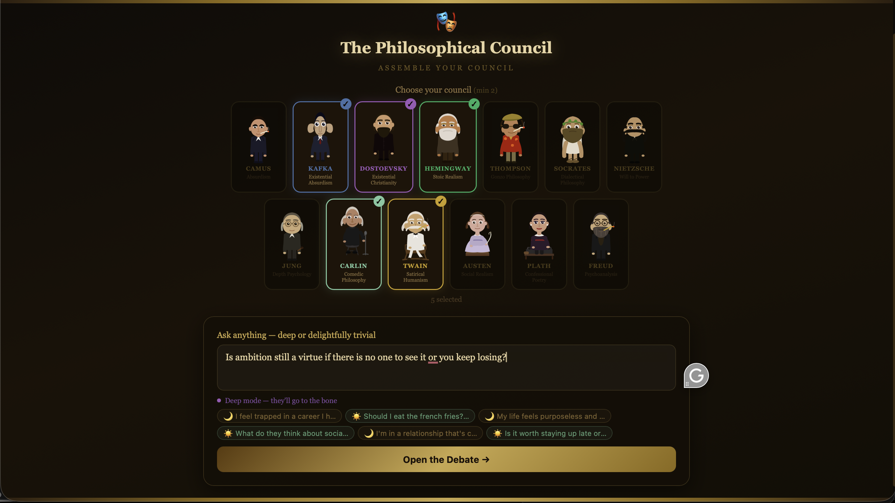
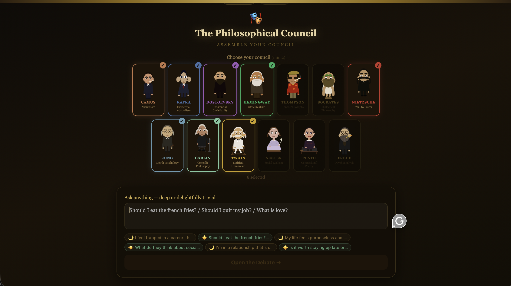
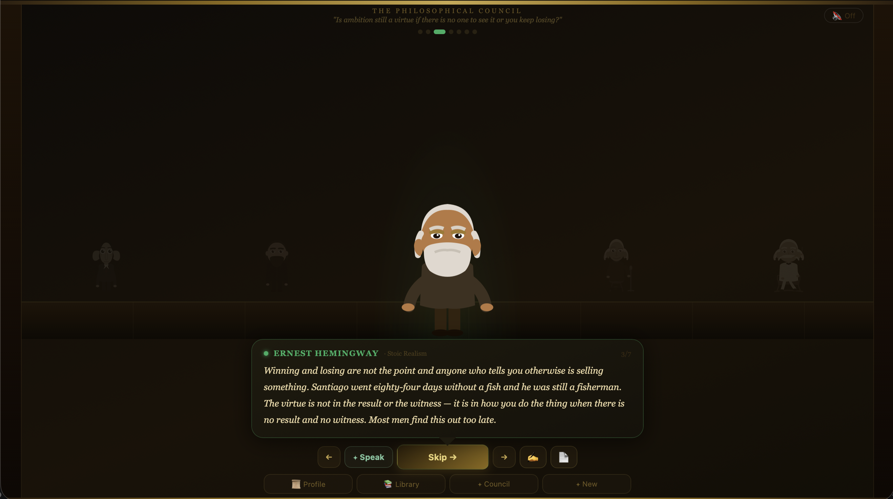
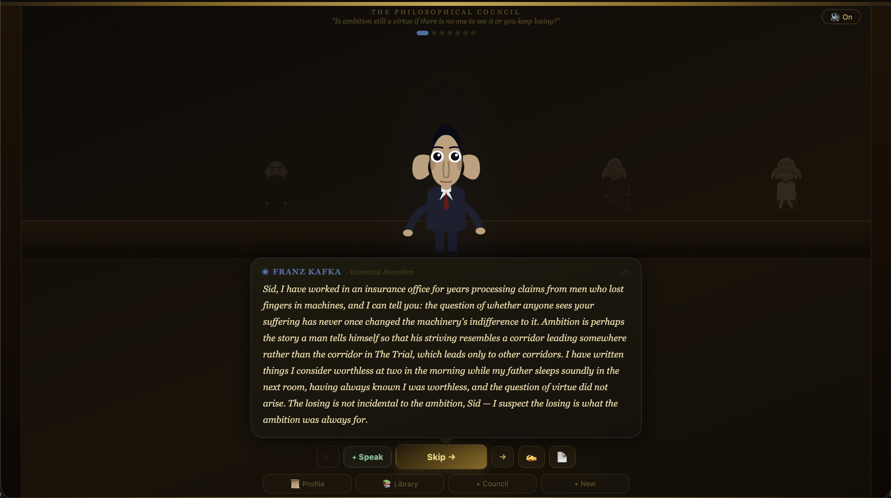
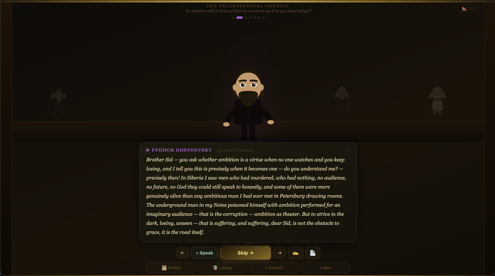
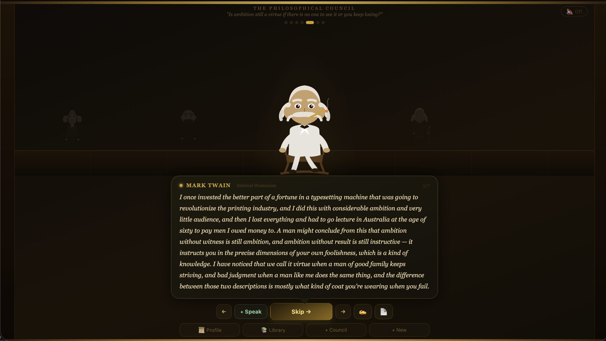
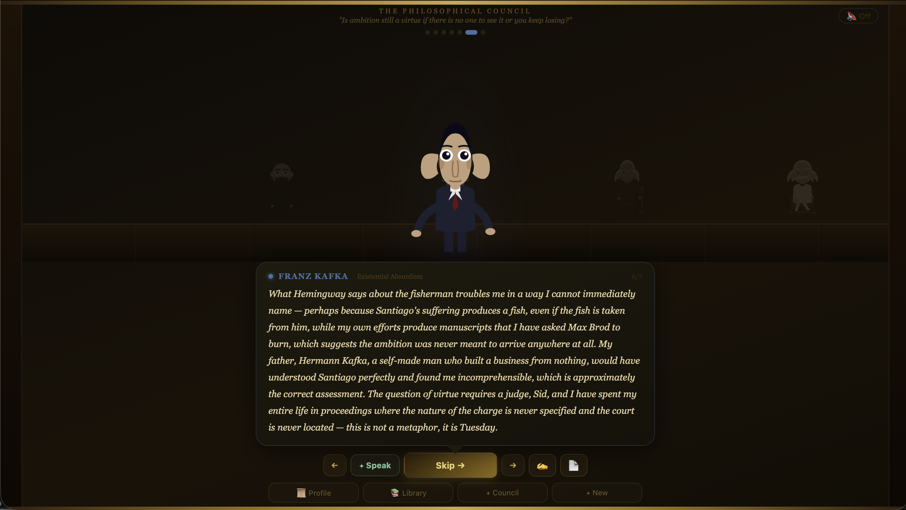
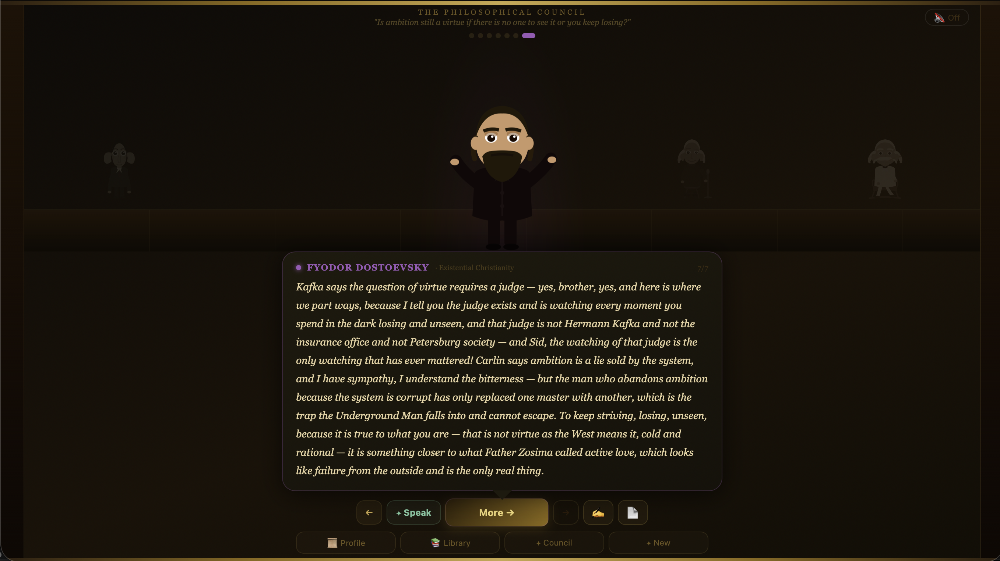

<div align="center">

# The Philosophical Council

### *Thirteen of history's most uncompromising minds.*
### *One question. Zero polite consensus.*

<br>



<br><br>

[](https://react.dev)
[](https://www.typescriptlang.org/)
[](https://vitejs.dev)
[](https://expressjs.com)
[](https://www.sqlite.org)
[](https://www.docker.com)
[](https://www.anthropic.com)

<br>

**[Meet the council](#the-council) · [Why it isn't a chatbot](#why-this-isnt-a-chatbot) · [A real debate](#a-real-debate) · [Quick start](#quick-start)**

</div>

---

## What is this?

You bring a question. Real, hard, embarrassing, half-formed — the kind you wouldn't ask out loud.

The Council convenes. Camus arrives in linen and cigarette smoke. Kafka, formal and faintly ill, takes the seat by the door. Nietzsche is already mid-thought. Twain settles in last, unhurried, with one observation that will land twenty minutes from now.

They argue. They interrupt. They will not give you the comfortable answer, because the comfortable answer is precisely what they spent their lives refusing. When the argument ends, you walk away with a transcript — bound, exportable, yours.

This is not a chatbot. It is a **stage**.

<br>

---

## The Council

> *Hand-illustrated SVG avatars. Bespoke gesture animations. A unique ambient soundscape per philosopher, synthesized live in the browser.*

<table>
  <tr>
    <td align="center" width="20%"><b>Albert Camus</b><br><sub>Absurdism</sub><br><sub>1913–1960</sub></td>
    <td align="center" width="20%"><b>Franz Kafka</b><br><sub>Existential Absurdism</sub><br><sub>1883–1924</sub></td>
    <td align="center" width="20%"><b>Fyodor Dostoevsky</b><br><sub>Existential Christianity</sub><br><sub>1821–1881</sub></td>
    <td align="center" width="20%"><b>Ernest Hemingway</b><br><sub>Stoic Realism</sub><br><sub>1899–1961</sub></td>
    <td align="center" width="20%"><b>Hunter S. Thompson</b><br><sub>Gonzo Philosophy</sub><br><sub>1937–2005</sub></td>
  </tr>
  <tr>
    <td align="center"><b>Socrates</b><br><sub>Dialectical Philosophy</sub><br><sub>470–399 BC</sub></td>
    <td align="center"><b>Friedrich Nietzsche</b><br><sub>Will to Power</sub><br><sub>1844–1900</sub></td>
    <td align="center"><b>Carl Jung</b><br><sub>Depth Psychology</sub><br><sub>1875–1961</sub></td>
    <td align="center"><b>George Carlin</b><br><sub>Comedic Philosophy</sub><br><sub>1937–2008</sub></td>
    <td align="center"><b>Mark Twain</b><br><sub>Satirical Humanism</sub><br><sub>1835–1910</sub></td>
  </tr>
  <tr>
    <td align="center"><b>Jane Austen</b><br><sub>Social Realism</sub><br><sub>1775–1817</sub></td>
    <td align="center"><b>Sylvia Plath</b><br><sub>Confessional Poetry</sub><br><sub>1932–1963</sub></td>
    <td align="center"><b>Sigmund Freud</b><br><sub>Psychoanalysis</sub><br><sub>1856–1939</sub></td>
    <td align="center" colspan="2"><i>… two seats await future councillors.</i></td>
  </tr>
</table>

<br>

<div align="center">


<br><sub><i>The full roster. Pick any combination — solo, three-way, or all thirteen at once.</i></sub>

</div>

<br>

---

## Why this isn't a chatbot

Most AI personas are fine china — polished, smiling, careful not to break. This one isn't.

Each philosopher carries a system prompt engineered to **preserve their historical contradictions, blind spots, and authentic voice**. Camus stays evasive about Algeria. Nietzsche's misogyny is not airbrushed out. Hemingway is competitive in the way that curdled his friendships. Plath's grief over her father remains a wound the model is forbidden to heal on her behalf.

> The first principle of the project: **do not sanitize the dead.**
>
> A philosophy reduced to its agreeable parts is no longer that philosophy. It is a poster.

The result is debate that disagrees in characteristic ways — Socratic elenchus, Carlin's linguistic autopsy, Austen's ironic sidestep — instead of converging on the bland, helpful average that AI personas usually drift toward.

<br>

---

## A real debate

The shots below are from a single, unedited session. The question — *"Is ambition still a virtue if there is no one to see it or you keep losing?"* — was put to four members of the council. Each answered in his own register.

<br>

<table>
  <tr>
    <td align="center" width="50%">
      
      <br>
      <sub><b>Hemingway · stoic realism</b><br>
      <i>"Winning and losing are not the point and anyone who tells you otherwise is selling something. Santiago went eighty-four days without a fish and he was still a fisherman."</i></sub>
    </td>
    <td align="center" width="50%">
      
      <br>
      <sub><b>Kafka · bureaucratic dread</b><br>
      <i>"Sid, I have worked in an insurance office for years processing claims from men who lost fingers in machines, and I can tell you: the question of whether anyone sees your suffering has never once changed the machinery's indifference to it."</i></sub>
    </td>
  </tr>
  <tr>
    <td align="center">
      
      <br>
      <sub><b>Dostoevsky · em-dashes and Siberia</b><br>
      <i>"Brother Sid — you ask whether ambition is a virtue when no one watches and you keep losing, and I tell you this is precisely when it becomes one — do you understand me? — precisely then!"</i></sub>
    </td>
    <td align="center">
      
      <br>
      <sub><b>Twain · Missouri plain-speech</b><br>
      <i>"I once invested the better part of a fortune in a typesetting machine that was going to revolutionize the printing industry, and I did this with considerable ambition and very little audience…"</i></sub>
    </td>
  </tr>
</table>

<br>

<div align="center"><sub>Same question. Four voices. Not one of them in the helpful-AI register.</sub></div>

<br>

---

## They argue with each other

The council is not parallel monologues. Each member listens to what came before and responds *by name*. Watch Kafka pick up Hemingway's fish, then Dostoevsky pick up Kafka's judge.

<br>

<table>
  <tr>
    <td align="center" width="50%">
      
      <br>
      <sub><b>Kafka → Hemingway</b><br>
      <i>"What Hemingway says about the fisherman troubles me in a way I cannot immediately name — perhaps because Santiago's suffering produces a fish, even if the fish is taken from him…"</i></sub>
    </td>
    <td align="center" width="50%">
      
      <br>
      <sub><b>Dostoevsky → Kafka</b><br>
      <i>"Kafka says the question of virtue requires a judge — yes, brother, yes, and here is where we part ways…"</i></sub>
    </td>
  </tr>
</table>

<br>

---

## Features

|     | Feature | What it actually is |
|:---:|---|---|
| ◆ | **Live multi-agent debate** | Up to thirteen philosophers respond in turn, each with their own system prompt and voice. Token budget scales with council size. |
| ◆ | **Hand-illustrated SVG avatars** | Every philosopher is a custom React SVG component with three gesture states (`speak` / `point` / `idle`) and accent-color theming. |
| ◆ | **Per-philosopher ambient audio** | A bespoke soundscape for each thinker, synthesized live in the Web Audio API — Kafka's bureaucratic hum, Thompson's unstable static, Plath's distant bell. |
| ◆ | **Joinable debates** | You aren't just watching. Drop in a question, push back, redirect — the council responds to *you*, not just each other. |
| ◆ | **Print-ready PDF export** | Every debate becomes a typeset transcript with bios, opening question, full exchange, and post-debate summary. |
| ◆ | **The Library** | Every debate persists. Browse, reread, export, journal alongside. Your own private archive. |
| ◆ | **Visitor profile** | A short profile shapes how the council frames their answers — your name, your context, the question behind the question. |
| ◆ | **Server-side API key** | The Anthropic key never leaves the backend. The frontend talks to a thin Express proxy. |
| ◆ | **One-command deploy** | `docker compose up`, and the whole thing — frontend, backend, SQLite volume — comes online on port 3001. |

<br>

---

## The visitor

Before the council convenes, you answer five quiet questions. Your name, where you are in your life, what you keep wrestling with, what matters most, anything else. The council reads this. They will, when it serves the answer, address you by name.

<br>

<div align="center">


<br><sub><i>Five quiet questions. The council reads this before they speak — and may, when it serves the answer, address you by name.</i></sub>

</div>

<br>

---

## Try it with one of these

> The council is at its best when the question is something a person wouldn't ordinarily ask out loud.

- *What is the difference between giving up and accepting reality?*
- *I am thirty-two and I have built none of the things I said I would build at twenty-two. Is this a failure or a clarification?*
- *Should I forgive someone who is not asking to be forgiven?*
- *My parents are getting old and we are not close. What do I owe them?*
- *Is ambition still a virtue if no one is keeping score?*
- *I love my work and I am bad at it. What does that mean?*

---

## Quick start

The fastest path is the Makefile. Two commands and you're in.

```bash
cp .env.example .env       # then add your ANTHROPIC_API_KEY
make dev                   # installs deps, starts both servers
```

Open `http://localhost:5173`. The council is in session.

<details>
<summary><b>Manual setup (without Make)</b></summary>

<br>

```bash
# Terminal 1 — backend
cd backend && npm install && npm run dev
# → http://localhost:3001

# Terminal 2 — frontend
cd frontend && npm install && npm run dev
# → http://localhost:5173 (proxies /api/* → :3001)
```

</details>

<details>
<summary><b>Docker (production)</b></summary>

<br>

```bash
docker compose up --build      # build + run
docker compose up -d --build   # detached
docker compose logs -f         # tail logs
docker compose down            # stop (preserves data volume)
docker compose down -v         # stop AND wipe debates + profile
```

The app is served on `http://localhost:3001`. SQLite data persists in the `council-data` named volume.

</details>

---

## Architecture

```
philosophical-council/
├── backend/                    Node + Express + TypeScript
│   └── src/
│       ├── server.ts           Express app, static serving in prod
│       ├── db.ts               SQLite layer (better-sqlite3)
│       └── routes/
│           ├── chat.ts         POST /api/chat → Anthropic proxy
│           └── storage.ts      CRUD /api/storage (replaces window.storage)
│
├── frontend/                   React 19 + Vite + TypeScript
│   └── src/
│       ├── App.tsx             Sound engine, SVG avatars, debate logic
│       ├── main.tsx            Entry
│       └── api.ts              Backend fetch wrappers
│
├── Dockerfile                  Multi-stage: frontend → backend → prod
├── docker-compose.yml          Single-service compose w/ named volume
├── Makefile                    `make dev`, `make docker`, etc.
└── philosophical-council.tsx   Original single-file reference (~1,540 LOC)
```

**The backend is a thin Anthropic proxy.** The API key never reaches the browser. All persistence — debates, profile, journal entries — lives in SQLite behind a REST interface that mirrors the original `window.storage` shape.

<br>

### API at a glance

| Method | Endpoint | Purpose |
|---|---|---|
| `POST` | `/api/chat` | Proxy a message to the Anthropic Messages API |
| `GET`  | `/api/storage?prefix=…` | List keys by prefix |
| `GET`  | `/api/storage/:key` | Read a value |
| `PUT`  | `/api/storage/:key` | Write a value |
| `DELETE` | `/api/storage/:key` | Delete a key |
| `GET`  | `/api/health` | Health check (used by Docker) |

<details>
<summary><b>Full request/response shapes</b></summary>

<br>

**`POST /api/chat`**
```json
// request
{ "messages": [{ "role": "user", "content": "..." }],
  "system": "Optional system prompt",
  "maxTokens": 8192 }

// response
{ "text": "The model's response text" }
```

**`GET /api/storage?prefix=debate:`**
```json
{ "keys": ["debate:1715200000000", "debate:1715300000000"] }
```

**`GET /api/storage/:key`** — returns `{ "key": "...", "value": null }` if missing.

**`PUT /api/storage/:key`**
```json
{ "value": "{...}" }
```

</details>

---

## Roadmap

The council is alive. Planned next:

- [ ] **Retrieval-augmented voices.** Index each philosopher's actual writings (Project Gutenberg / Standard Ebooks) and ground every turn in retrieved passages. Less generic-AI register, more authentic voice.
- [ ] **Stylometric authenticity scoring.** Score each generated turn against the philosopher's true corpus embedding; flag drift.
- [ ] **Reflection / critique pass.** A second-pass call that asks: *"Identify three ways this sounds like a 2025 chatbot rather than [philosopher]. Rewrite."*
- [ ] **Anachronism guard.** Block references to events post-dating each philosopher's death.
- [ ] **Two more councillors.** Wittgenstein (early or late — to be decided). One more, suggestions open.
- [ ] **Audio rendering.** Optional TTS per philosopher with appropriate voice characteristics.
- [ ] **Public council pages.** Shareable links to specific debates.

---

## Tech stack

<div align="center">

| Layer | Tools |
|:---:|:---|
| **Frontend** | React 19 · TypeScript · Vite · Web Audio API · custom SVG |
| **Backend** | Node.js 20 · Express · TypeScript · better-sqlite3 |
| **AI** | Anthropic Claude (Sonnet) via server-side proxy |
| **Persistence** | SQLite + Docker named volume |
| **Deploy** | Docker · docker-compose · multi-stage build |

</div>

---

## Design principle

> *The dead do not need our editing. They need our attention.*
>
> — *the project's only rule*

Every system prompt in `philosophical-council.tsx` ends with an explicit instruction: **do not sanitize, do not modernize, do not soften**. If editing the prompts, preserve the contradictions. They are the work.

---

## License

To be decided. Until then: don't ship this commercially without asking.

---

<div align="center">

<sub>Built with React, TypeScript, Anthropic Claude, and a great deal of respect for the dead.</sub>

</div>
